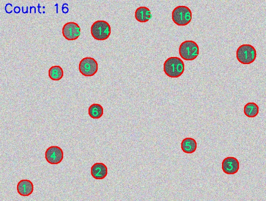

# Report 1
## Requirements
- Description: For a given set of noisy images, automatically detect the targets in the images using image enhancement and processing techniques, and output the number of targets along with their corresponding locations.

- Example:
    

- Programming language: Python + OpenCV
- Submission content: source code, results, report

## Implementation
### Methodology
From the example image, we can see that the targets are black circles on a white background, but the image has low contrast and salt-and-pepper noise.

To extract the targets, we can divide the image into dark and bright regions, which represent the targets and the background, respectively. Therefore, we can use Otsu's thresholding to automatically determine the optimal threshold value for separating the targets from the background. However, before applying Otsu's thresholding, we need to enhance the contrast of the image and reduce the noise to improve the accuracy of target detection.

To effectively remove the noise while preserving the edges of the targets, we first restore the contrast of the image. Additionally, it is better to apply Gaussian blur before median blur.

### Overview
1. Read every file in the input directory and make the output directory if it doesn't exist, then process every file that has one of the specified extensions in `EXTS`
2. Pre-process:
    1. Convert the image to uint8 if it's not already in that format
    2. Convert the image to grayscale if it's in color
    3. Apply histogram equalization to enhance the contrast of the image
    4. Apply Gaussian blur to reduce noise and smooth the image
    5. Apply median blur to further reduce salt-and-pepper noise
3. Process:
    1. Apply Otsu's thresholding to convert the pre-processed image to a binary image
    2. If the original image is grayscale, convert it to BGR format for drawing contours and text
    3. If the target is black, invert the binary image to make the target white and the background black
    4. Find contours in the binary image, which represent the detected targets
    5. Draw the contours on the original image and label each contour with a number indicating its order
    6. Count the total number of contours and display the count on the image

### Parameters
- `GUAS_BLUR_KERNEL_SIZES`: The kernel size for Gaussian blur
- `GUAS_BLUR_SIGMA`: The standard deviation for Gaussian blur
- `MED_BLUR_KERNEL_SIZES`: The kernel size for median blur
- `IS_TAR_BLACK`: The flag indicating whether the targets are black regions of the binary image
- `DRAW_COUNTER_COLOR`: The color for drawing contour boundaries
- `DRAW_COUNTER_THICKNESS`: The thickness of the contour boundaries
- `COUNTER_FONT_SCALE`: The scale for the font used to display the counter
- `COUNTER_FONT_COLOR`: The color for the font used to display the counter
- `COUNTER_FONT_THICKNESS`: The thickness of the font used to display the counter
- `CNTR_FONT_SCALE`: The scale for the font used to display contour labels
- `CNTR_FONT_COLOR`: The color for the font used to display contour labels
- `CNTR_FONT_THICKNESS`: The thickness of the font used to display contour labels
- `EXTS`: The tuple of file extensions to process

`GUAS_BLUR_KERNEL_SIZES`, `GUAS_BLUR_SIGMA`, and `MED_BLUR_KERNEL_SIZES` are tweaked to achieve the desired results while matching the labeling order in the example image. `COUNTER_FONT_COLOR` and `CNTR_FONT_COLOR` are set to match the example image.

### Features
- The code will print a message if no files with the specified extensions are found in the input directory or if any file fails to process (`None` is returned by the `proc` function)
- The label for each contour is placed at the centroid of the contour, which is calculated using image moments, but since there is no displacement applied, it's the top-left corner of the label text that is placed at the centroid
- If the moments of a contour are zero (which can happen for very small contours), the label will be placed at coordinates (-1, -1), which is the bottom-right corner of the image
- The count of contours is displayed at the top-left corner of the image, with the text "Count: " followed by the number of contours detected just as in the example image (the position is calculated so that the top-left corner of the count text is at (0, font_height), where font_height is the height of the text in pixels)

## Code
```py
import numpy as np
import cv2
from pathlib import Path

GUAS_BLUR_KERNEL_SIZES = (5, 5)
GUAS_BLUR_SIGMA = 1
MED_BLUR_KERNEL_SIZES = 13
IS_TAR_BLACK = True
DRAW_COUNTER_COLOR = (0, 0, 255)
DRAW_COUNTER_THICKNESS = 2
COUNTER_FONT_SCALE = 0.5
COUNTER_FONT_COLOR = (0, 255, 0)
COUNTER_FONT_THICKNESS = 2
CNTR_FONT_SCALE = 1
CNTR_FONT_COLOR = (255, 0, 0)
CNTR_FONT_THICKNESS = 2
EXTS = ("*.jpg",)


def cvrt2uint8(img):
    if img.dtype == np.uint8:
        return img
    return cv2.convertScaleAbs(
        cv2.normalize(img, np.zeros_like(img), 0, 255, cv2.NORM_MINMAX)
    )


def pre_proc(img):
    if img is not None:
        img = cvrt2uint8(img)
        return cv2.medianBlur(
            cv2.GaussianBlur(
                cv2.equalizeHist(
                    (
                        cv2.cvtColor(img, cv2.COLOR_BGR2GRAY)
                        if img.shape[2] == 3
                        else cv2.cvtColor(img, cv2.COLOR_BGRA2GRAY)
                    )
                    if img.ndim > 2
                    else img
                ),
                GUAS_BLUR_KERNEL_SIZES,
                sigmaX=GUAS_BLUR_SIGMA,
                sigmaY=GUAS_BLUR_SIGMA,
            ),
            MED_BLUR_KERNEL_SIZES,
        )
    return None


def proc(path):
    org_img = cv2.imread(str(path), cv2.IMREAD_UNCHANGED)
    if org_img is not None:
        img = pre_proc(org_img.copy())
        _, bin_img = cv2.threshold(img, 0, 255, cv2.THRESH_BINARY + cv2.THRESH_OTSU)
        if org_img.ndim == 2:
            org_img = cv2.cvtColor(org_img, cv2.COLOR_GRAY2BGR)
        if IS_TAR_BLACK:
            bin_img = cv2.bitwise_not(bin_img)
        contours, _ = cv2.findContours(bin_img, cv2.RETR_TREE, cv2.CHAIN_APPROX_NONE)
        cnt = 0
        for contour in contours:
            cv2.drawContours(
                org_img, [contour], -1, DRAW_COUNTER_COLOR, DRAW_COUNTER_THICKNESS
            )
            cnt += 1
            m = cv2.moments(contour)
            if m["m00"] != 0:
                cx = int(m["m10"] / m["m00"])
                cy = int(m["m01"] / m["m00"])
            else:
                cx, cy = -1, -1
            cv2.putText(
                org_img,
                str(cnt),
                (cx, cy),
                cv2.FONT_HERSHEY_SIMPLEX,
                COUNTER_FONT_SCALE,
                COUNTER_FONT_COLOR,
                COUNTER_FONT_THICKNESS,
            )
        s = str(cnt)
        (_, font_height), _ = cv2.getTextSize(
            s, cv2.FONT_HERSHEY_SIMPLEX, CNTR_FONT_SCALE, CNTR_FONT_THICKNESS
        )
        cv2.putText(
            org_img,
            f"Count: {cnt}",
            (0, font_height),
            cv2.FONT_HERSHEY_SIMPLEX,
            CNTR_FONT_SCALE,
            CNTR_FONT_COLOR,
            CNTR_FONT_THICKNESS,
        )
        return org_img
    return None


if __name__ == "__main__":
    inp = Path("dataset/")
    out = Path("output/")
    out.mkdir(exist_ok=True)
    files = []
    for e in EXTS:
        files.extend(inp.glob(e))
    if files:
        for f in files:
            name, ext = f.stem, f.suffix
            res = proc(f)
            if res is not None:
                cv2.imwrite(str(out / f"{name}{ext}"), res)
            else:
                print(f"Failed to process {f}")
    else:
        print(f"No image files found in {inp.resolve()}")

```

## Results
For the example image mentioned in the requirements:

