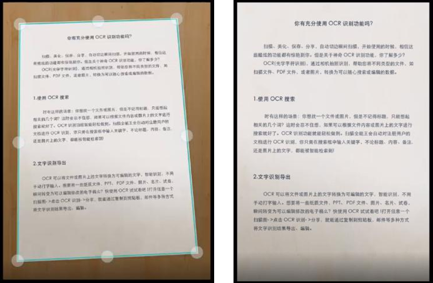
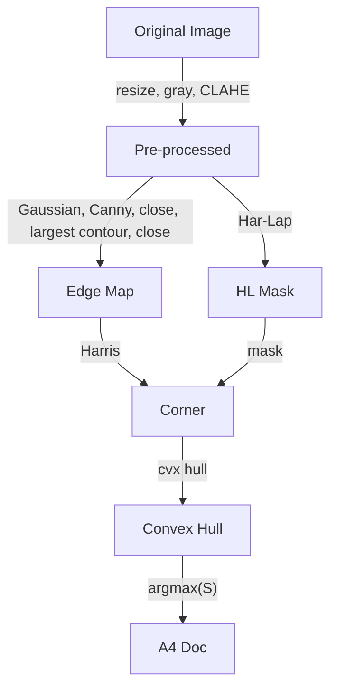

<!--
编程作业2：文档扫描
 若学生多次提交作业，成绩计算请以评分规则为准
作业内容我的作业
是否计入总成绩 否公布成绩时间 马上公布活动时间 结束于2026.04.03 23:59作业形式 个人作业计分规则 最高得分完成指标 提交作业
评分方式
(
教师评阅 100.0%
)
 教师评阅占成绩比例 100.0%
作业说明
拍一张A4纸文稿的图片，利用角点检测、边缘检测等，再通过投影变换完成对文档的对齐扫描。

注：A4规格为21cm×29.7cm

Clipboard Image.png
(https://lnt.xmu.edu.cn/api/uploads/10931613/in-rich-content?created_at=2026-03-18T11:07:46Z, 1775319981_Clipboard Image.png)
-->
# Report 2
## Requirements
Take a photo of an A4 document, use corner detection, edge detection, etc., and then complete the alignment scanning of the document through perspective transformation.


## Implementation
### Methodology
Real-world document scanning involves complex challenges: images are often taken in cluttered environments, document placement and orientation are arbitrary, lighting is uneven, and image resolutions vary significantly.

To tackle these issues, our methodology relies on a robust pipeline:
- Scale and Illumination Invariance: Since edge and corner detection algorithms depend heavily on kernel sizes and thresholds, we first resize the image so its shortest side equals a fixed value (720px). To handle uneven lighting and shadows, Contrast Limited Adaptive Histogram Equalization (CLAHE) is applied.
- Robust Edge Extraction: To isolate the document from the complex background and text patterns, we apply Canny edge detection followed by morphological closing to ensure document boundaries are continuous. By extracting the largest connected component from the contours, we effectively filter out internal text and background noise.
- High-Purity Corner Detection: Detecting corners directly on the raw image introduces too much noise, while detecting them solely on the closed edge map might yield false geometric corners. To solve this, we extract Harris-Laplace keypoints from the original pre-processed image to create a spatial mask, and then perform Harris corner detection on the edge map restricted by this mask.
- Geometry Rectification: The document might be deformed or photographed at an angle. We compute the convex hull of the filtered corners and find the specific combination of 4 points that yields the maximum area. This ensures we capture the outermost boundaries of the document. Finally, assuming a standard A4 portrait orientation, we map these four points to a perfectly rectangular grid using perspective transformation.

### Overview


### Parameters
- `RESIZE_MIN_SIDE`: The fixed length to which the shorter side of the input image is resized for scale normalization
- `CLAHE_CLIP` and `CLAHE_GRID`: Parameters for the CLAHE algorithm to enhance local contrast
- `GAUS_K_CANNY`, `GAUS_S_CANNY`, `CANNY_T1`, `CANNY_T2`, `CANNY_APT`: Parameters for Gaussian blur and Canny edge detection
- `MP_K0`, `MP_IT0`, `MP_K1`, `MP_IT1`: Parameters for morphological closing operations
- `GAUS_K_HL`, `GAUS_S_HL`, `HL_OCT`, `HL_CTH`, `HL_DTH`, `HL_MC`, `HL_NL`: Parameters for Harris-Laplace keypoint detection
- `HL_FILTER_DIST`: Distance threshold for filtering corners based on Harris-Laplace keypoints
- `MAX_CORNERS`, `NMS_Q`, `NMS_R`, `HAR_BS`, `HAR_K`: Parameters for Harris corner detection and non-maximum suppression
- `BORDER_C`, `BORDER_THICK`, `QUAD_R`, `QUAD_OPA`: Parameters for visualizing the detected quadrilateral
- `A4_RATIO`: The aspect ratio of an A4 document (21:29.7)
- `EXTS`: The tuple of file extensions to process
- `DEBUG`: Flag to enable or disable debug image saving
  - `DEBUG_PATH`, `F_NAME`, `F_EXT`: Parameters for debug image saving
  - `HL_C`, `CORN_R`, `CORN_C`, `HULL_THICK`, `HULL_C`: Parameters for debug visualization of Harris-Laplace keypoints, corners, and convex hull

All parameters are carefully tuned to achieve robust performance across a number of real-world document images while maintaining computational efficiency. The scale normalization ensures that the same parameter values can be applied consistently regardless of the input image resolution, and the combination of edge-based and keypoint-based corner detection significantly reduces false positives from text and background clutter.

### Features
- The code will print a message if no files with the specified extensions are found in the input directory or if any file fails to process (`None` is returned by the `proc` function)

## Code
```python
import numpy as np
import cv2
from itertools import combinations
from pathlib import Path

RESIZE_MIN_SIDE = 720
CLAHE_CLIP = 5.0
CLAHE_GRID = (13, 13)
GAUS_K_CANNY = (5, 5)
GAUS_S_CANNY = 2.725
CANNY_T1 = 0.725e4
CANNY_T2 = 3.375e4
CANNY_APT = 7
MP_K0 = (7, 7)
MP_IT0 = 1
MP_K1 = (5, 5)
MP_IT1 = 3
GAUS_K_HL = (25, 25)
GAUS_S_HL = 1.125
HL_OCT = 4
HL_CTH = 4.5e-2
HL_DTH = 1.175e-2
HL_MC = 1325
HL_NL = 4
HL_FILTER_DIST = 16
MAX_CORNERS = 10
NMS_Q = 9.75e-2
NMS_R = 50
HAR_BS = 3
HAR_K = 7.75e-2
BORDER_C = (0, 255, 0)
BORDER_THICK = 3
QUAD_R = 12.5
QUAD_OPA = 0.6
A4_RATIO = 21 / 29.7
EXTS = ("*.jpg",)

DEBUG = True
# DEBUG = False
if DEBUG:
    DEBUG_PATH = Path("debug/")
    DEBUG_PATH.mkdir(exist_ok=True)
    F_NAME = ""
    F_EXT = ""
    HL_C = (0, 255, 0)
    CORN_R = 5
    CORN_C = (0, 255, 0)
    HULL_THICK = 3
    HULL_C = (255, 0, 0)


def u8(img):
    if img is not None and img.dtype != np.uint8:
        img = cv2.convertScaleAbs(
            cv2.normalize(img, np.zeros_like(img), 0, 255, cv2.NORM_MINMAX)
        )
    return img


def pre_proc(img):
    img = u8(img)
    sc = 0
    if img is not None:
        sc = RESIZE_MIN_SIDE / min(img.shape[:2])
        img = cv2.resize(
            img,
            (int(img.shape[1] * sc), int(img.shape[0] * sc)),
            interpolation=cv2.INTER_AREA if sc < 1 else cv2.INTER_LINEAR,
        )
        img = cv2.createCLAHE(CLAHE_CLIP, CLAHE_GRID).apply(
            img
            if img.ndim == 2
            else (
                cv2.cvtColor(img, cv2.COLOR_BGR2GRAY)
                if img.shape[2] == 3
                else cv2.cvtColor(img, cv2.COLOR_BGRA2GRAY) if img.ndim > 2 else img
            )
        )
        if DEBUG:
            cv2.imwrite(str(DEBUG_PATH / f"01_pre_{F_NAME}{F_EXT}"), img)
    return img, sc


def get_edge(gray):
    canny = None
    if gray is not None:
        img = cv2.morphologyEx(
            cv2.Canny(
                cv2.GaussianBlur(gray, GAUS_K_CANNY, GAUS_S_CANNY),
                CANNY_T1,
                CANNY_T2,
                apertureSize=CANNY_APT,
                L2gradient=True,
            ),
            cv2.MORPH_CLOSE,
            cv2.getStructuringElement(cv2.MORPH_RECT, MP_K0),
            iterations=MP_IT0,
        )
        if DEBUG:
            cv2.imwrite(str(DEBUG_PATH / f"02_canny_{F_NAME}{F_EXT}"), img)
        if img.sum() > 0:
            contours, _ = cv2.findContours(
                img, cv2.RETR_EXTERNAL, cv2.CHAIN_APPROX_NONE
            )
            img = np.zeros_like(img)
            for contour in contours:
                cv2.drawContours(img, [contour], -1, 255, thickness=1)
            if DEBUG:
                cv2.imwrite(str(DEBUG_PATH / f"03_contours_{F_NAME}{F_EXT}"), img)
            _, labels, stats, _ = cv2.connectedComponentsWithStats(img)
            img = (labels == np.argmax(stats[1:, cv2.CC_STAT_AREA]) + 1).astype(
                np.uint8
            ) * 255
            canny = cv2.morphologyEx(
                img,
                cv2.MORPH_CLOSE,
                cv2.getStructuringElement(cv2.MORPH_RECT, MP_K1),
                iterations=MP_IT1,
            )
            if DEBUG:
                cv2.imwrite(str(DEBUG_PATH / f"04_edge_{F_NAME}{F_EXT}"), canny)
    return canny


def get_quad(hull):
    best_quad = None
    max_area = 0
    if hull is not None and len(hull) >= 4:
        hull = hull.reshape(-1, 2)
        for quad in combinations(hull, 4):
            quad = np.array(quad)
            area = cv2.contourArea(quad)
            if area > max_area:
                max_area = area
                center = quad.mean(axis=0)
                best_quad = quad[
                    np.argsort(
                        np.arctan2(quad[:, 1] - center[1], quad[:, 0] - center[0])
                    )
                ]
    return best_quad, max_area


def proc(path):
    detected, scanned = None, None
    org_img = cv2.imread(str(path), cv2.IMREAD_UNCHANGED)
    pre_img, sc = pre_proc(org_img)
    if pre_img is not None:
        edge = get_edge(pre_img)
        if edge is not None:
            hl_pts = cv2.xfeatures2d.HarrisLaplaceFeatureDetector_create(
                HL_OCT, HL_CTH, HL_DTH, HL_MC, HL_NL
            ).detect(cv2.GaussianBlur(pre_img, GAUS_K_HL, GAUS_S_HL))
            if DEBUG:
                cv2.imwrite(
                    str(DEBUG_PATH / f"05_hl_{F_NAME}{F_EXT}"),
                    cv2.drawKeypoints(
                        cv2.cvtColor(pre_img, cv2.COLOR_GRAY2BGR),
                        hl_pts,
                        None,
                        HL_C,
                        cv2.DrawMatchesFlags_DRAW_RICH_KEYPOINTS,
                    ),
                )
            if hl_pts:
                hl_mask = np.zeros_like(pre_img)
                for pt in hl_pts:
                    x, y = int(pt.pt[0]), int(pt.pt[1])
                    r = int(pt.size / 2) + HL_FILTER_DIST
                    cv2.circle(hl_mask, (x, y), r, 255, thickness=-1)
                if DEBUG:
                    cv2.imwrite(
                        str(DEBUG_PATH / f"06_hl_mask_{F_NAME}{F_EXT}"), hl_mask
                    )
                corners = cv2.goodFeaturesToTrack(
                    edge,
                    MAX_CORNERS,
                    NMS_Q,
                    NMS_R,
                    mask=hl_mask,
                    blockSize=HAR_BS,
                    useHarrisDetector=True,
                    k=HAR_K,
                )
                if DEBUG:
                    corner_img = cv2.cvtColor(edge, cv2.COLOR_GRAY2BGR)
                    if corners is not None:
                        for c in corners:
                            x, y = c.ravel()
                            cv2.circle(corner_img, (int(x), int(y)), CORN_R, CORN_C, -1)
                    cv2.imwrite(
                        str(DEBUG_PATH / f"07_corners_{F_NAME}{F_EXT}"), corner_img
                    )
                if corners is not None and len(corners) >= 4:
                    hull = cv2.convexHull(corners.reshape(-1, 2))
                    if DEBUG:
                        cv2.imwrite(
                            str(DEBUG_PATH / f"08_hull_{F_NAME}{F_EXT}"),
                            cv2.polylines(
                                corner_img,
                                [hull.astype(np.int32)],
                                True,
                                HULL_C,
                                HULL_THICK,
                            ),
                        )
                    if len(hull) >= 4:
                        detected = org_img.copy()
                        detected = (
                            cv2.cvtColor(detected, cv2.COLOR_GRAY2BGR)
                            if detected.ndim == 2
                            else (
                                detected
                                if detected.shape[2] == 3
                                else cv2.cvtColor(detected, cv2.COLOR_BGRA2BGR)
                            )
                        )
                        quad, area = get_quad(hull)
                        quad = (np.array(quad) / sc).astype(np.int32)
                        cv2.polylines(
                            detected,
                            [quad],
                            True,
                            BORDER_C,
                            int(BORDER_THICK / sc),
                        )
                        overlay = detected.copy()
                        r = int(QUAD_R / sc)
                        for i in range(len(quad)):
                            p1 = quad[i]
                            cv2.circle(overlay, tuple(p1), r, (255, 255, 255), -1)
                            p2 = quad[(i + 1) % len(quad)]
                            cv2.circle(
                                overlay,
                                ((p1[0] + p2[0]) // 2, (p1[1] + p2[1]) // 2),
                                r,
                                (255, 255, 255),
                                -1,
                            )
                        detected = cv2.addWeighted(
                            overlay, QUAD_OPA, detected, 1 - QUAD_OPA, 0
                        )
                        area = area / (sc**2)
                        h = int(np.sqrt(area / A4_RATIO))
                        w = int(h * A4_RATIO)
                        scanned = cv2.warpPerspective(
                            org_img,
                            cv2.getPerspectiveTransform(
                                np.array(quad, dtype=np.float32),
                                np.array(
                                    [[0, 0], [w, 0], [w, h], [0, h]],
                                    dtype=np.float32,
                                ),
                            ),
                            (w, h),
                        )
    return detected, scanned


if __name__ == "__main__":
    inp = Path("input/")
    out = Path("output/")
    out.mkdir(exist_ok=True)
    files = []
    for e in EXTS:
        files.extend(inp.glob(e))
    if files:
        for f in files:
            name, ext = f.stem, f.suffix
            if DEBUG:
                F_NAME, F_EXT = name, ext
            det, scn = proc(f)
            if det is not None and scn is not None:
                cv2.imwrite(str(out / f"{name}_detected{ext}"), det)
                cv2.imwrite(str(out / f"{name}_scanned{ext}"), scn)
            else:
                print(f"Failed to process {f}")
    else:
        print(f"No image files found in {inp.resolve()}")

```

## Results
- 
    
    
- 
    
    
