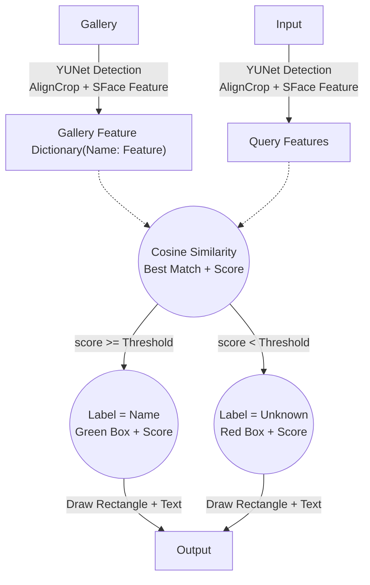

<!--
编程作业3：人脸识别程序
 若学生多次提交作业，成绩计算请以评分规则为准
作业内容我的作业
是否计入总成绩 是（成绩类别 : 平时成绩）公布成绩时间 马上公布活动时间 结束于2026.04.25 23:59作业形式 个人作业计分规则 最高得分完成指标 提交作业
评分方式
(
教师评阅 100.0%
)
 教师评阅占成绩比例 100.0%
作业说明
完成一个人脸识别的程序，可以识别你宿舍的几位同学
人脸检测
人脸特征提取与比对
提交形式: Python代码 + 报告
-->
# Report 3
## Requirements
- Implement a complete face recognition program that can identify several dormitory classmates
    - Face detection
    - Face feature extraction & comparison
- Submission format: Python code + (2~3 page) report
- Submit within 2 weeks

- Reference
    - [https://docs.opencv.org/4.9.0/d0/dd4/tutorial_dnn_face.html](https://docs.opencv.org/4.9.0/d0/dd4/tutorial_dnn_face.html)
    - Face detector: `cv2.FaceDetectorYN`
    - Face feature extract: `cv2.FaceRecognizerSF`

## Implementation
### Methodology
Following the reference, we can use `cv2.FaceDetectorYN` for face detection and then use `cv2.FaceRecognizerSF` for face feature extraction. For face recognition, we can calculate the cosine similarity between the query feature and the gallery features, and then determine the best match based on a predefined threshold.

### Overview


### Parameters
- `OUTPUT_PATH`: Output directory for processed images
- `MODEL_PATH`: Directory containing the ONNX models for face detection and recognition
- `RECT_COLOR`: Color for drawing rectangles around detected faces
- `RECT_THICKNESS`: Thickness of the rectangles drawn around detected faces
- `FONT_Y_OFFSET`: Vertical offset for placing text above the detected face
- `FONT_SCALE`: Scale factor for the font used in labeling detected faces
- `FONT_COLOR`: Color for the text used in labeling detected faces
- `FONT_THICKNESS`: Thickness of the text used in labeling detected faces
- `COSINE_THRESHOLD`: Threshold for cosine similarity to determine if a detected face matches a gallery face
- `RECT_COLOR_UNKNOWN`: Color for drawing rectangles around faces that do not match any gallery faces
- `FONT_COLOR_UNKNOWN`: Color for the text used in labeling faces that do not match any gallery faces
- `EXTS`: Tuple of file extensions to consider when processing images in the gallery and input directories
- `GALLERY_PATH`: Directory containing the gallery images
- `GALLERY_OUTPUT_PATH`: Directory for saving processed gallery images with detected faces
- `INPUT_PATH`: Directory containing the input images to be processed for face recognition

### Features
- Uses file names as labels for gallery faces, and appends an index for multiple faces in the same image
- Skips to add features and returns `None` for gallery images that fail to load or do not contain any detectable faces
- Return `None` for input images that fail to load or do not contain any detectable faces
- Print a message for each gallery image that fails to build the gallery, and for each input image that fails to process
- Prints a message if no valid gallery features are extracted, and does not attempt to process input images in that case

## Code
```python
from pathlib import Path
import cv2
import numpy as np

OUTPUT_PATH = Path("output/")
MODEL_PATH = Path("models/")
RECT_COLOR = (0, 255, 0)
RECT_THICKNESS = 2
FONT_Y_OFFSET = 5
FONT_SCALE = 0.5
FONT_COLOR = (0, 255, 0)
FONT_THICKNESS = 1
COSINE_THRESHOLD = 0.363
RECT_COLOR_UNKNOWN = (0, 0, 255)
FONT_COLOR_UNKNOWN = (0, 0, 255)
EXTS = ("*.jpg", "*.png", "*.webp")
GALLERY_PATH = Path("gallery/")
GALLERY_OUTPUT_PATH = OUTPUT_PATH / "gallery/"
INPUT_PATH = Path("input/")

face_detector = cv2.FaceDetectorYN_create(
    str(MODEL_PATH / "face_detection_yunet_2023mar.onnx"), "", (0, 0)
)
face_recognizer = cv2.FaceRecognizerSF_create(
    str(MODEL_PATH / "face_recognition_sface_2021dec.onnx"), ""
)


def pre_proc(path, gallery_dict, detector, recognizer):
    if gallery_dict is None:
        gallery_dict = {}
    img = cv2.imread(str(path), cv2.IMREAD_UNCHANGED)
    if img is not None:
        detector.setInputSize((img.shape[1], img.shape[0]))
        _, faces = detector.detect(img)
        if faces is not None and len(faces) > 0:
            for i, face in enumerate(faces):
                gallery_dict[path.stem + path.suffix + f"_{i}"] = recognizer.feature(
                    recognizer.alignCrop(img, face)
                ).flatten()
                x, y, w, h = map(int, face[:4])
                cv2.rectangle(img, (x, y), (x + w, y + h), RECT_COLOR, RECT_THICKNESS)
                cv2.putText(
                    img,
                    f"{i}",
                    (x, y - FONT_Y_OFFSET),
                    cv2.FONT_HERSHEY_SIMPLEX,
                    FONT_SCALE,
                    FONT_COLOR,
                    FONT_THICKNESS,
                )
        else:
            img = None
    return gallery_dict, img


def proc(path, gallery_dict, detector, recognizer):
    img = None
    if gallery_dict is not None and len(gallery_dict) > 0:
        org_img = cv2.imread(str(path), cv2.IMREAD_UNCHANGED)
        if org_img is not None:
            detector.setInputSize((org_img.shape[1], org_img.shape[0]))
            _, faces = detector.detect(org_img)
            if faces is not None and len(faces) > 0:
                img = org_img
                for face in faces:
                    feature = recognizer.feature(
                        recognizer.alignCrop(org_img, face)
                    ).flatten()
                    tag, sim = None, -1
                    for k, v in gallery_dict.items():
                        tmp = np.dot(feature, v) / (
                            (np.linalg.norm(feature) * np.linalg.norm(v))
                        )
                        if tmp > sim:
                            tag = k
                            sim = tmp
                    x, y, w, h = map(int, face[:4])
                    cv2.rectangle(
                        img,
                        (x, y),
                        (x + w, y + h),
                        RECT_COLOR if sim >= COSINE_THRESHOLD else RECT_COLOR_UNKNOWN,
                        RECT_THICKNESS,
                    )
                    cv2.putText(
                        img,
                        (
                            f"{tag} ({sim:.2f})"
                            if sim >= COSINE_THRESHOLD
                            else f"Unknown ({sim:.2f})"
                        ),
                        (x, y - FONT_Y_OFFSET),
                        cv2.FONT_HERSHEY_SIMPLEX,
                        FONT_SCALE,
                        FONT_COLOR if sim >= COSINE_THRESHOLD else FONT_COLOR_UNKNOWN,
                        FONT_THICKNESS,
                    )
    return img


if __name__ == "__main__":
    gallery = {}
    for ext in EXTS:
        for g_path in GALLERY_PATH.glob(ext):
            gallery, res = pre_proc(g_path, gallery, face_detector, face_recognizer)
            if res is not None:
                GALLERY_OUTPUT_PATH.mkdir(exist_ok=True, parents=True)
                cv2.imwrite(
                    str(GALLERY_OUTPUT_PATH / f"{g_path.stem}{g_path.suffix}"), res
                )
            else:
                print(f"Failed to build gallery for {g_path}")
    if gallery is not None and len(gallery) > 0:
        for ext in EXTS:
            for g_path in INPUT_PATH.glob(ext):
                res = proc(g_path, gallery, face_detector, face_recognizer)
                if res is not None:
                    cv2.imwrite(str(OUTPUT_PATH / f"{g_path.stem}{g_path.suffix}"), res)
                else:
                    print(f"Failed to process {g_path}")
    else:
        print("No valid gallery features extracted")

```

## Results
- Gallery
    - 
    - 
    - 
- Output
    - 
    - 
    - 
