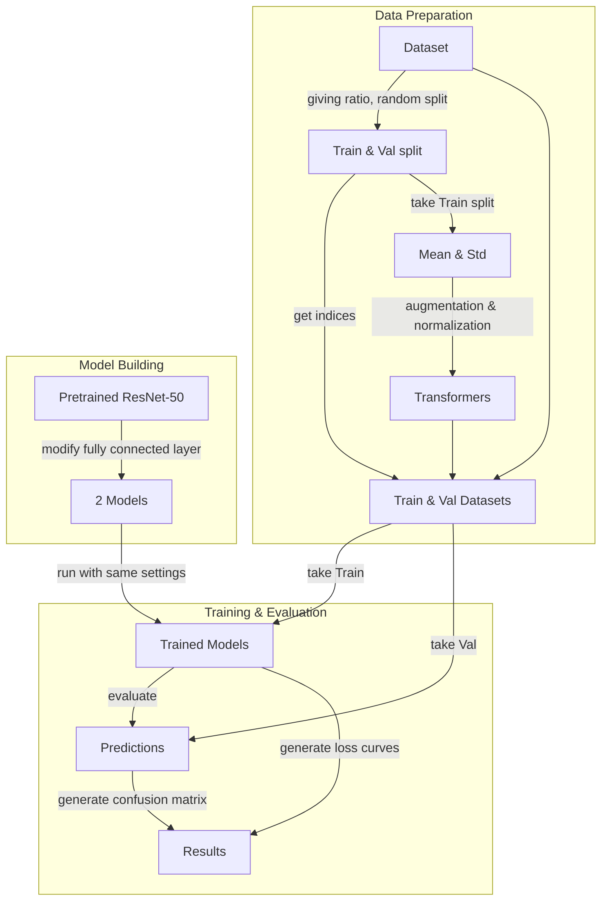

<!--
编程左右5：图像分类（迁移学习）
 若学生多次提交作业，成绩计算请以评分规则为准
作业内容我的作业
是否计入总成绩 是（成绩类别 : 平时成绩）公布成绩时间 马上公布活动时间 结束于2026.05.10 23:59作业形式 个人作业计分规则 最高得分完成指标 提交作业
评分方式
(
教师评阅 100.0%
)
 教师评阅占成绩比例 100.0%
作业说明
利用Fine-tuning完成图像分类
ResNet-50模型
数据集：Scene categories （15类）（50%训练、50%测试）
对比微调最后一层以及整个模型的结果、并绘制混淆矩阵
数据集下载链接：https://figshare.com/articles/dataset/15-Scene_Image_Dataset/7007177
参考链接：https://pytorch.org/tutorials/beginner/transfer_learning_tutorial.html
-->
# Report 4
## Requirements
Use fine-tuning to complete image classification
- ResNet-50 model
- Dataset: Scene categories (15 classes) (50% training, 50% testing)
- Compare the results of fine-tuning the last layer and the entire model, and draw a confusion matrix
- Dataset download link: [https://figshare.com/articles/dataset/15-Scene_Image_Dataset/7007177](https://figshare.com/articles/dataset/15-Scene_Image_Dataset/7007177)
- Reference link: [https://pytorch.org/tutorials/beginner/transfer_learning_tutorial.html](https://pytorch.org/tutorials/beginner/transfer_learning_tutorial.html)

## Implementation
### Methodology
Following the reference, this work builds a unified PyTorch pipeline for scene classification with a pretrained ResNet-50 model. The dataset is randomly split into two equal parts for training and testing with a fixed seed to ensure reproducibility. To improve training stability, the mean and standard deviation are computed from the training subset and used for normalization. The training set applies data augmentation such as random resized cropping and horizontal flipping, while the test set uses deterministic resize and center crop preprocessing.

Two fine-tuning strategies are compared under the same training and evaluation framework. In the first setting, the entire ResNet-50 model is fine-tuned end-to-end. In the second setting, only the final fully connected layer is trainable, so the pretrained backbone is kept frozen and the classifier is replaced to match the 15 scene categories. Both models use the same loss function, optimizer, and learning-rate scheduler, and their training curves are recorded for comparison. After training, the models are evaluated on the test set, where predictions are converted to class labels and used to compute accuracy and draw the confusion matrix for a more detailed comparison of class-wise performance.

### Overview


### Parameters
- `DEVICE`: The device to run the model on
- `MAX_EPOCHS_PRINT`: The maximum number of epochs to print during training/evaluation
- `MAX_MODEL_SAVE`: The maximum number of models to save during training
- `SEED`: The random seed for reproducibility
- `RUNNER`: The classification runner instance
- `MODEL_DIR`: The directory to save the models
- `MODEL_PARAMS`: The parameters for the ResNet-50 model
- `CLS_NAMES`: The class names of the dataset
- `CM_TEXT_TH_F`: The threshold factor for text color in the confusion matrix plot
- `CRITERION`: The loss function for training
- `TRAIN_SET`, `VAL_SET`: The training and validation datasets
- `BATCH_SIZE`: The batch size for training and evaluation
- `OPT`: The optimizer class to use for training
- `OPT_PARAMS`: The parameters for the optimizer
- `OUTPATH`: The directory to save the outputs (models, images)
- `SCHEDULER`: The learning rate scheduler class to use for training
- `EPOCHS`: The number of epochs to train the model
- `SCHE_PARAMS`: The parameters for the learning rate scheduler
- `IMG_PATH`: The directory to save the images (loss curves, confusion matrices)

### Features
- The device is automatically selected based on availability, with a fallback to CPU.
- If the number of epochs is less than or equal to `MAX_EPOCHS_PRINT`, the loss will be printed for every epoch. Otherwise, the loss will be printed for every `epochs // MAX_EPOCHS_PRINT` epochs. The same logic applies to model saving.
- If multiple classes have the same maximum output value during prediction, one of them will be randomly selected as the predicted class to avoid bias.
- The score of `ClassificationRunner` is calculated as the number of correct predictions, which can be used to compute accuracy.
- The `mean` and `std` are computed from the original training subset, but the transforms applied is the same as the one used for validation, different from the one used for training (random resized crop and horizontal flip)
- If the `save_path` is not provided for plotting functions, the plots will be displayed instead of saved.
- Because crop is applied (whether random for training or center for validation and mean/std computation), so the "real" label of that cropped image may be different from the original one.
- `MODEL_DIR` and `IMG_PATH` are not the direct path to save the models and images, but the subdirectory path under `OUTPATH` to save the models and images. But the `MODEL_DIR` is the direct path for pytorch hub to save the pretrained model.
- The saved model files are organized by the name of the model (a directory for each model) and the epoch number.

## Code
```python
import torch
from torch import accelerator, Generator, hub
from torch.utils.data import DataLoader, random_split, Subset
import time
import os
from tqdm import tqdm
from torchvision import datasets, models, transforms
import torch.nn as nn
from matplotlib import pyplot as plt
import numpy as np
import torch.optim as optim
from torch.optim import lr_scheduler
from typing import cast, Sized
from sklearn.metrics import confusion_matrix

DEVICE = (
    cast(str | torch.device | int, accelerator.current_accelerator())
    if accelerator.is_available()
    else torch.device("cpu")
)
MAX_EPOCHS_PRINT = 100
MAX_MODEL_SAVE = 5
SEED = 42


class MLRunner:
    def __init__(
        self,
        criterion=None,
        dataset=None,
        device=torch.device("cpu"),
        model=None,
        opt=None,
        score_fn=None,
        seed=SEED,
        *args,
        **kwargs,
    ):
        self.criterion = criterion
        self.dataset = dataset
        self.device = device
        self.model = model
        self.opt = opt
        self.score_fn = score_fn
        self.seed = seed
        if self.dataset is None:
            self.dataloader = None
        else:
            self.dataloader = DataLoader(self.dataset, *args, **kwargs)

    @staticmethod
    def get_predicts(ys):
        return ys

    def set_criterion(self, criterion):
        self.criterion = criterion
        return self.criterion

    def set_dataset(self, dataset):
        self.dataset = dataset
        return self.dataset

    def set_dataloader(self, *args, **kwargs):
        self.dataloader = DataLoader(self.dataset, *args, **kwargs)
        return self.dataloader

    def set_model(self, model):
        self.model = model
        return self.model

    def set_opt(self, opt, *args, **kwargs):
        self.opt = opt(
            filter(lambda p: p.requires_grad, self.model.parameters()), *args, **kwargs
        )
        return self.opt

    def fit(
        self, save_dir=None, is_train=False, scheduler=None, epochs=1, *args, **kwargs
    ):
        assert self.dataloader is not None
        since = time.time()
        if save_dir is not None:
            os.makedirs(save_dir, exist_ok=True)
        ls, preds, scores = [], [], []
        if is_train:
            if scheduler is not None:
                scheduler = scheduler(self.opt, *args, **kwargs)
            self.model.train()
        else:
            self.model.eval()
        for ep in range(epochs):
            ls.append(0)
            if not is_train:
                preds.append([])
                scores.append(0)
            for x, y in tqdm(self.dataloader, desc=f"Epoch {ep+1}/{epochs}"):
                x, y_device = x.to(self.device), y.to(self.device)
                with torch.set_grad_enabled(is_train):
                    outputs = self.model(x)
                    loss = self.criterion(outputs, y_device)
                    if is_train:
                        self.opt.zero_grad()
                        loss.backward()
                        self.opt.step()
                    else:
                        ps = self.get_predicts(outputs)
                        preds[-1].append(ps)
                        scores[-1] += self.score_fn(ps, y).item()
                ls[-1] += loss.item() * x.size(0)
            ls[-1] /= len(cast(Sized, cast(object, self.dataloader.dataset)))
            if (epochs <= MAX_EPOCHS_PRINT) or (
                (ep + 1) % (epochs // MAX_EPOCHS_PRINT) == 0
            ):
                print(f"Epoch {ep+1}/{epochs}, Loss: {ls[-1]:.6f}")
            if is_train:
                if save_dir is not None and (
                    (epochs <= MAX_MODEL_SAVE)
                    or ((ep + 1) % (epochs // MAX_MODEL_SAVE) == 0)
                ):
                    torch.save(
                        self.model.state_dict(),
                        os.path.join(save_dir, f"model_epoch{ep+1}.pth"),
                    )
                if scheduler is not None:
                    scheduler.step()
            else:
                preds[-1] = torch.cat(preds[-1])
        time_elapsed = time.time() - since
        if is_train:
            return ls, time_elapsed
        else:
            return ls, preds, scores, time_elapsed


class ClassificationRunner(MLRunner):
    def __init__(self, *args, **kwargs):
        super().__init__(*args, **kwargs)
        self.score_fn = self.get_score

    def get_predicts(self, ys):
        ys = ys.cpu()
        mask = ys == torch.max(ys, 1, True).values
        ids = torch.where(mask)[1]
        cnts = mask.sum(1)
        offsets = (
            torch.randint(
                0,
                ys.size(1),
                (ys.size(0),),
                generator=Generator().manual_seed(self.seed),
            )
            % cnts
        )
        starts = torch.cat((torch.tensor([0]), torch.cumsum(cnts, dim=0)[:-1]))
        return ids[starts + offsets]

    @staticmethod
    def get_score(preds, ys):
        return (preds == ys).sum()


RUNNER = ClassificationRunner(device=DEVICE)
MODEL_DIR = "models"
MODEL_PARAMS = {"weights": "IMAGENET1K_V1"}
data_dir, resize, crop = "data/15-Scene", 256, 224
d_s = datasets.ImageFolder(
    data_dir,
    transform=transforms.Compose(
        [transforms.Resize(resize), transforms.CenterCrop(crop), transforms.ToTensor()]
    ),
)
CLS_NAMES = d_s.classes
hub.set_dir(MODEL_DIR)


def build_model(freeze):
    model = models.resnet50(**MODEL_PARAMS)
    if freeze:
        for param in model.parameters():
            param.requires_grad = False
    model.fc = nn.Linear(model.fc.in_features, len(CLS_NAMES))
    return model


def plot_loss(losses, name, save_path=None):
    plt.plot(losses, label="loss")
    plt.xlabel("Epoch")
    plt.ylabel("Loss")
    plt.title(f"{name} Training Loss")
    plt.grid()
    plt.legend()
    if save_path:
        plt.savefig(save_path)
    else:
        plt.show()
    plt.close()


CM_TEXT_TH_F = 0.5


def plot_confusion_matrix(cm, classes, name, save_path=None):
    plt.imshow(cm, interpolation="nearest")
    thresh = cm.max() * CM_TEXT_TH_F
    for i in range(cm.shape[0]):
        for j in range(cm.shape[1]):
            plt.text(
                j,
                i,
                format(cm[i, j], "d"),
                horizontalalignment="center",
                color="black" if cm[i, j] > thresh else "white",
            )
    marks = np.arange(len(classes))
    plt.xticks(marks, classes)
    plt.gca().xaxis.tick_top()
    plt.yticks(marks, classes)
    plt.ylabel("True label")
    plt.xlabel("Predicted label")
    plt.gca().xaxis.set_label_position("top")
    plt.title(f"{name} Confusion Matrix")
    plt.colorbar()
    plt.tight_layout()
    if save_path:
        plt.savefig(save_path)
    else:
        plt.show()
    plt.close()


CRITERION = nn.CrossEntropyLoss()
t_p = 0.5
TRAIN_SET, VAL_SET = random_split(d_s, [t_p, 1 - t_p], Generator().manual_seed(SEED))
mean, std = (torch.zeros(3) for _ in range(2))
n = 0
for img, _ in DataLoader(TRAIN_SET, batch_size=1000):
    n += img.size(0) * img.size(2) * img.size(3)
    mean += img.sum(dim=[0, 2, 3])
    std += (img**2).sum(dim=[0, 2, 3])
mean /= n
std = (std / n - mean**2).sqrt()
TRAIN_SET = Subset(
    datasets.ImageFolder(
        data_dir,
        transform=transforms.Compose(
            [
                transforms.RandomResizedCrop(crop),
                transforms.RandomHorizontalFlip(),
                transforms.ToTensor(),
                transforms.Normalize(mean, std),
            ]
        ),
    ),
    TRAIN_SET.indices,
)
BATCH_SIZE = 4
OPT = optim.Adam
OPT_PARAMS = {"lr": 1e-3}
OUTPATH = "outputs"
SCHEDULER = lr_scheduler.StepLR
EPOCHS = 25
SCHE_PARAMS = {"step_size": 7, "gamma": 0.1}
IMG_PATH = "imgs"
VAL_SET = Subset(
    datasets.ImageFolder(
        data_dir,
        transform=transforms.Compose(
            [
                transforms.Resize(resize),
                transforms.CenterCrop(crop),
                transforms.ToTensor(),
                transforms.Normalize(mean, std),
            ]
        ),
    ),
    VAL_SET.indices,
)


def run_model(runner, model, name):
    runner.set_criterion(CRITERION)
    runner.set_dataset(TRAIN_SET)
    runner.set_dataloader(batch_size=BATCH_SIZE, shuffle=True)
    runner.set_model(model)
    runner.set_opt(OPT, **OPT_PARAMS)
    train_ls, _ = runner.fit(
        f"{OUTPATH}/{MODEL_DIR}/{name}", True, SCHEDULER, EPOCHS, **SCHE_PARAMS
    )
    os.makedirs(f"{OUTPATH}/{IMG_PATH}", exist_ok=True)
    plot_loss(train_ls, name, save_path=f"{OUTPATH}/{IMG_PATH}/loss_{name}.png")
    runner.set_dataset(VAL_SET)
    runner.set_dataloader(batch_size=BATCH_SIZE, shuffle=False)
    _, preds, _, _ = runner.fit(is_train=False)
    plot_confusion_matrix(
        confusion_matrix(
            [
                cast(datasets.ImageFolder, VAL_SET.dataset).targets[i]
                for i in VAL_SET.indices
            ],
            preds[-1].numpy(),
        ),
        CLS_NAMES,
        name,
        save_path=f"{OUTPATH}/{IMG_PATH}/cm_{name}.png",
    )


if __name__ == "__main__":
    run_model(RUNNER, build_model(freeze=False).to(DEVICE), "ResNet50_FineTune")
    run_model(RUNNER, build_model(freeze=True).to(DEVICE), "ResNet50_LastLayer")

```

## Results
### ResNet50_FineTune


### ResNet50_LastLayer


